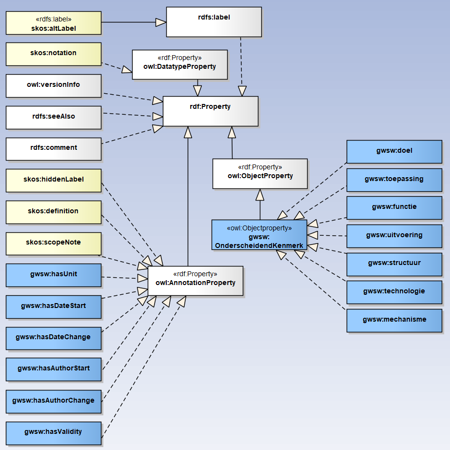
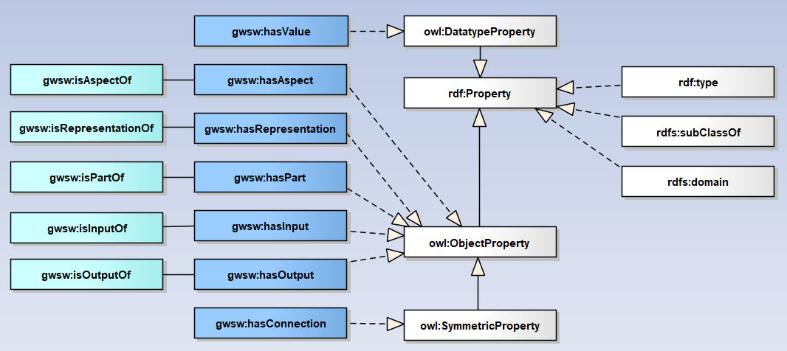

# GWSW Ontologie in RDF

<!-- gebruik voor lokaal editen -->

**Een beschrijving van het protocol GWSW-OroX versie 1.6**

Van: Stichting RIONED

Versie historie

20210319: Modelleerprincipes verder uitgewerkt  
20210319: Herziene hoofdstukindeling, samenvatting (oorspronkelijk hst 2) in modelleerprincipes (nieuwe hst 2) en details (blijft hst 3) ondergebracht  
20201219-20210223: In kader Gellish-ontmanteling

* verwijzing naar bijlage in opmerking-annotatie vervangen door rdfs:seeAlso-verwijzing naar document-URL
* URI's voor aspect properties vragen extra aandacht voor hoofdlettergevoeligheid. Nu bestaan bijvoorbeeld gwsw:functie en gwsw:Functie naast elkaar. (hst 3.1.1)
* op basis NTA8035: consequent de term properties voor predicates hanteren, onderverdeeld in attributen (annotaties en aspecten) en relaties
* onderscheidende kenmerken met specifiek predicate (kwalitatieve aspect property) toekennen. Voorsorteren op NTA8035, annuleer de ingewikkelde intersection-restrictie (hst 3.3) (20210109)
* gebruik van annotaties per concept-type beschreven (tabel in hst 3.1.2) (20210103)
* omgaan met context-specifieke codering gewijzigd, consequent specifiek datatype hanteren (hst 3.1.3)
* gwsw:hasAuthorStart (bij gwsw:hasDateStart) en gwsw:hasAuthorChange (bij gwsw:hasDateChange) toegevoegd
* gwsw:hasValidity (conformiteit-markers) toegevoegd
* skos:scopeNote (deel-datamodel/filter/collection of facts) toegevoegd
* rdfs:isDefinedBy vervangen door rdfs:seeAlso (is de superclass)
* blank node   From/intersectionOf wordt expliciet type owl:Class (hst 3.6) (wordt niet meer gebruikt, zie punt dd 20210109)
* groepering van klasse-concepten niet ook typeren als type collectie, dat geeft ongewenste vermenging van annotaties in RDF-editors (met name skos:scopeNote) (hst 3.7)  

20200812: Modelleringsprincipes toegevoegd (hst 1.5)  
20191030: Tabel met Top Level concepten toegevoegd (hst 2.3)  
20190813: Toelichting op inrichting GWSW-OroX (hst 1.3)  
20190521: Diagram met structuur GWSW Relaties toegevoegd  
20190518: URL binnen rdfs:comment in apart predicate rdfs:seeAlso ondergebracht  
20181003: Subtitel toegevoegd: dit is het GWSW-OroX protocol  
20180305: Onderscheidende kenmerken uitgebreid voor activiteiten  
20171028: Samenvatting completer gemaakt  
20171023: Eerste gepubliceerde versie  
20171013: Eerste opzet document  

# Inleiding

Het W3C definieert standaarden voor het Semantisch Web met als basis de triple-vorm: de Subject-Predicate-Object constructie. Het basisprotocol dat hieraan ten grondslag ligt is RDF.

De term RDF wordt in deze notitie gebruikt voor de combinatie van meerdere protocollen: RDF, RDFS en OWL 2.  

Het GegevensWoordenboek Stedelijk Water (GWSW), een ontwikkeling van de stichting RIONED, is oorspronkelijk ontwikkeld in de Gellish taal. Ook Gellish is een semantische modelleringstaal in het zogenaamde ORO (Object-Relatie-Object) formaat. In het najaar van 2015 is het GWSW omgezet naar RDF.

*Met dank aan:*

Daan Oostinga  
Mike Henrichs  
Michel Böhms  
Matthé van Koetsveld  
Linda van den Brink  

Tot en met GWSW versie 1.5.1 (medio 2020) heeft het GWSW-projectteam in de “backend” situatie het Gellish formaat toegepast voor ontologie-ontwerp en -beheer. Via een geautomatiseerd proces werd echter gepubliceerd conform de RDF semantiek. Vanaf versie 1.6 wordt het GWSW volledig met RDF tools ontwikkeld en onderhouden.

## Leeswijzer

Bij de uitwerking van deze tekst is er van uitgegaan dat de lezer bekend is met de principes en semantiek van RDF/RDFS/OWL 2 en het uitwisselformaat Turtle.

In de voorbeelden en in de praktijk (bij uitwisseling van GWSW-gegevens) gebruiken we het Turtle-formaat. Voor de concepten binnen de GWSW-Ontologie hanteren we in de voorbeelden de prefix “gwsw:”. Voor individuen in een dataset wordt de prefix “ex:” gebruikt.

In dit inleiding vindt u de gebruikte begrippen en uitgangspunten bij de modellering. In het volgende hoofdstuk worden modelleringsprincipes toegelicht. Het laatste hoofdstuk bevat de gedetailleerde uitwerking van het RDF model, gecombineerd met voorbeelden van het datamodel en datasets.

## Gebruikte begrippen

**RDF, RDFS, OWL 2**
RDF staat voor Resource Description Framework, de basisdefinitie van modellen op basis van subject-predicate-object. In de tekst verstaan we onder RDF de combinatie van RDF met RDFS (RDF Schema) en OWL 2 (Web Ontology Language).

**Ontologie**
Datastructuur die alle relevante entiteiten en hun onderlinge relaties en regels binnen een domein bevat. (bron: Wikipedia)

**Individu**
Een instantie van een concept, iets uit de werkelijkheid. Zoals individu “0980” de bestaande betonnen constructie van het soort/klasse/concept “rioolput” is.

**Property**
Voor de relatie (tussen subject en object) zijn meerdere namen gebruikelijk (“predicate”, “property name”), we hanteren in dit document “property”. Properties zijn (confrom de NTA8035) onderverdeeld in attributen (die weer onderverdeeld zijn in aspecten en annotaties) en relaties.

**CE**
De afkorting CE wordt gebruikt voor Class Expressions (in Description Logics “complex concepts”). CE’s worden ondermeer gevormd door Classes te binden aan Property Expressions. Met Class Expressions kunnen we onder andere restricties benoemen voor Properties waarmee concepten/klassen worden onderscheiden.

**Dataset**
Een dataset bevat de beschrijving van een fysiek stedelijk water systeem, de “individuen” op basis van het GWSW. De term **ABox** wordt ook gebruikt: “assertion components” binnen een ontologie. Voor het model (de concepten) wordt dan de term **TBox** gebruikt: “terminological components”.

## Inrichting GWSW-OroX protocol

De GWSW ontologie wordt beschreven volgens het GWSW OroX protocol. Dit protocol onderscheidt zich door diepgang in semantiek en reikwijdte in de toepassing (van systeem tot proces). Het protocol beschrijft zowel het GWSW model (de "TBox", zie data.gwsw.nl) als de daarop gebaseerde datasets (de "ABox", zie apps.gwsw.nl).

De datastructuur is object-georiënteerd waarbij relaties tussen objecten in een aantal structuren zijn ondergebracht:

* Soortenboom (de taxonomie of klasse-indeling)
* Samenstelling (de meronomie of deel-geheel indeling)
* Proces (het activiteiten-schema)
* Groepering (collecties van soorten en individuen)

Belangrijke superklassen zijn:

* gwsw:FysiekObject
* gwsw:Activiteit
* gwsw:Ruimte
* gwsw:Levenvorm

Bij het ontwerp van een datastructuur spelen deze elementen de hoofdrol, ze vormen het ontwerpkader.

Met het principe van object-oriëntatie hanteert het model overerving-principes en maakt het zo expliciet mogelijk onderscheid in subklassen van de genoemde superklassen. Dat is een heel andere benadering dan bijvoorbeeld het ontwerp van een relationeel model waarbij de nadruk ligt op het interpreteren van informatie met een hoofdrol voor de normalisatie-techniek om opslagruimte te beperken en redundantie te voorkomen.

## Uitgangspunten

Voor de modellering is uitgegaan van het OWL RL (Rule Language) profiel. Dit profiel gebruikt nagenoeg alle OWL 2 semantiek en is toereikend voor het modelleren van de GWSW-Ontologie.

Voor de definitie van klassen, eigenschappen, datatypen en restricties kunnen verschillende benaderingen gekozen worden. De volgende uitgangspunten zijn gehanteerd:

* Bij het ontwerp van het GWSW in RDF wordt het oorspronkelijke Gellish-model zonder informatieverlies getransformeerd naar het RDF-model.
* In het verlengde daarvan: Voor de indeling in soorten, de vaststelling van de taxonomie, wordt de onderscheidende definitie zo expliciet mogelijk beschreven.
* Bij de modellering is rekening gehouden met de reasoner-prestaties, de benodigde rekenkracht voor de inferencing verschilt sterk per gekozen oplossing. Voor deze afweging is de Pellet reasoner versie 2.3.1 (voor OWL 2 RL) gebruikt.

# Modelleerprincipes

Een groot deel van de gehanteerde modelleerprincipes stammen uit de oorspronkelijke opzet (gestart in 2006) van het model in Gellish-vorm. Deze principes zijn natuurlijk taalonafhankelijk, ook in de RDF-vorm blijven ze van groot belang. Veel dank gaat naar Andries van Renssen, geestelijk vader van Gellish en Matthé van Koetsveld, intensief betrokken bij de modellering in Gellish van het GWSW en zijn voorlopers.

## Structureren

Zoals genoemd is de datastructuur object-georiënteerd waarbij objecten in een aantal hoofdstructuren zijn ondergebracht:

* Soortenboom (de taxonomie of klasse-indeling)
* Samenstelling (de meronomie of deel-geheel indeling en de processchema's)
* Proces (het activiteiten-schema)
* Groeperingen (collecties van individuen of soorten)

Bij het ontwerp spelen deze structuren de hoofdrol, ze vormen het ontwerpkader. Met het principe van object-oriëntatie hanteert het model overerving-principes en maakt zo expliciet mogelijk onderscheid in (relaties tussen) subtypes.

**Voorbeelden ter illustratie:**  
Afgeleide gegevens komen niet voor in de definitie van fysieke objecten, bijvoorbeeld het kenmerk "aantal pompen". Zo'n gegeven wordt (in presentaties) afgeleid uit het aantal voorkomens van de relatie gwsw:hasPart tussen Gemaal en Pomp. De objecten Gemaal en Pomp worden expliciet beschreven.  
Afgeleide gegevens zoals rekenresultaten en data-analyses komen in het GWSW wel voor in de vorm van gemodelleerde rapportages, bijvoorbeeld in GWSW Kentallen.  
Eigenschappen van de bovengrond en ondergrond (maaiveldhoogte, grondsoort) komen niet voor als aspecten van de fysieke objecten die zich daarin bevinden. Een leiding heeft niet als kenmerk "Grondsoort", wel wordt er een relatie gwsw:isPartOf met de ondergrond - en dus met bijbehorende kenmerken - gedefinieerd.

**"As is", een momentopname**  
Het datamodel is ingericht op een "as is" situatie, het bevat een momentopname van systemen en processen binnen de discipline stedelijk water. Het beschrijft dus geen historische gegevens of de levenscyclus van objecten zoals binnen de context van system engineering.

## Concepten en annotaties

1. Elk GWSW-concept is van het generieke type owl:Class.
2. Een concept en elke CE wordt altijd voorzien van de annotaties zoals opgenomen in hst [Annotaties bij concepten](#annotaties-bij-concepten)

## Naamgeving

_Terminologie_

Zie hst [Identificatie van concepten](#identificatie-van-concepten)  

1. Een concept wordt geïdentificeerd door de URI (prefix + naam)
2. Volg de gebruikelijke termen binnen het vakgebied, bedenk geen nieuwe conceptnamen die misschien de lading beter dekken of neutraler zijn. Dat geldt ook - waar mogelijk - voor abstracte concepten.
3. Geef alle gebruikelijke vakgebied-termen die gelden voor het te modelleren systeem of proces een plek, als apart concept of als synoniem van een concept. De zoekfunctie wordt daarmee volledig.
4. Laat algemene termen die niet specifiek bij de discipline horen zoveel mogelijk buiten beschouwing. Modelleer bijvoorbeeld het concept "calamiteit" alleen als het als supertype nodig is.
5. Verwijs voor algemene termen waar mogelijk naar andere databronnen (rdfs:seeAlso).

## Data-afleiding en validatie

Definieer klassen zo uitgebreid mogelijk op basis van hun eigenschappen. Daarmee worden datasets op basis van het datamodel ruimer interpreteerbaar en beter valideerbaar. Hier volgt een opsomming van de mogelijke afleidingen (inferences) en uit de CE's afgeleide validaties. In enkele gevallen is reasoning op basis van het UNA (Unique Name Assumption) principe nodig. De controle op kardinaliteit is beperkt vanwege het OWA (Open World Assumption) principe in RDF.

* Controle op hasReference-waarden binnen domein van collecties / keuzelijsten (UNA)
* Controle op correcte typering binnen samenstellingen via gwsw:hasPart.
    - Ruimte gwsw:hasPart “Object”. Object: alleen van de klasse Ruimte of FysiekObject
    - FysiekObject gwsw:hasPart “Object”. Object: alleen van de klasse Ruimte of FysiekObject
* Inferencing: Individu-klasse wordt afgeleid uit intrinsiek aspect.
    - gwsw:hasAspect BreedteLeiding =&gt; Individu = Leiding
* Inferencing: Individu-klasse wordt afgeleid uit onderscheidend kenmerk.
    - gwsw:hasAspect Uitvoering + hasReference Klein =&gt; Individu = KleinObject
* Controle op correct gebruik datatype bij gwsw:hasValue: decimal, string, integer, double, date, time, year.
* Controle op numerieke waarden binnen minimum maximum grenzen
* Kardinaliteit, aantal voorkomens per property boven het voor het type gedefinieerde maximum wordt gemeld (UNA)
    - ook “inverse”-kardinaliteit wordt in de reasoning meegenomen
    - minimum kardinaliteit en shall-relatie wel gemodelleerd, controle op strijdigheid met typering niet mogelijk (OWA)
  
## Specialiseren

### Onderscheidende kenmerken

Het specialiseren, opbouwen van de soortenboom, zie hst [Details onderscheidende kenmerken](#details-onderscheidende-kenmerken)

1. Voor het classificeren van een concept uitgaan van onderscheidende kenmerken in de (abstracte) soortenboom. Denk aan determineren van planten volgens Linnaeus: na het maken van een aantal keuzes wordt de soort gevonden
2. Streef ernaar om met de onderscheidende kenmerken de (in je hoofd) uitgeschreven definitie te vervangen
3. Gebruik de beschreven onderscheidende kenmerken bij fysieke objecten en activiteiten
4. Kwalificeer het onderscheidende kenmerk impliciet (gwsw:uitvoering "groot"). Expliciete kwalificaties (in de vorm van subtypes van generieke kenmerken) worden dus niet gebruikt (zijn - nog - onnodig)

### Abstracte concepten

_Klassen (en collecties) die niet voor classificatie worden gebruikt_

1. Hou ze beperkt, de soortenboom zo veel mogelijk concreet houden. Supertypes zijn vaak alleen verdichtingen, geen soort.
2. Concepten zijn herkenbaar als abstract wanneer ze bijvoorbeeld niet in de deel-geheel relaties (bijvoorbeeld als deel van een rioleringsgebied) voorkomen.
3. Abstracte concepten bij voorkeur als groep/collectie (en niet als supertype) definiëren. Bijvoorbeeld groepering naar thema's, denk aan infiltratievoorzieningen.
4. Subtypes op hetzelfde niveau dienen in grote lijn hetzelfde samenstellingsniveau te hebben.

### Erven van samenstellingen

1. Voorkom redundantie van deel-geheel relaties, die relatie mag niet dubbel voorkomen voor een subtype en het bijbehorende supertype.
2. Definieer de samenstelling - hoewel verleidelijk - dus niet op een te hoog niveau

### Bladerobjecten

1. Specialiseer de concepten zoveel als mogelijk: definieer de subtypes, de "bladerobjecten".
2. Introduceer geen subtype als het geen onderscheidend kenmerk heeft. Bijvoorbeeld geen extra subtype "standaard hemelwaterstelsel" naast "verbeterd hemelwaterstelsel".
3. Hou er rekening mee dat de individuen zo specifiek mogelijk geclassificeerd dienen te worden. Classificatie met een supertype gebeurt alleen als het subtype niet van toepassing is (denk aan het eerdere voorbeeld "hemelwaterstelsel") of als het onbekend is en wel toegepast kan worden. Bijvoorbeeld bij gebruik van de inspectienorm voor "vrijverval rioolleidingen" (met subtypes gemengd, hemelwater, vuilwater).

## Aspecten en relaties

Beschrijf alle relevante aspecten en relaties bij een concept.

1. Beschrijf met CE's op de kardinaliteit alle mogelijk voorkomende properties (uitgezonderd de annotatie-attributen), ook als ze niet definiërend zijn. Hanteer de kardinaliteit "minimum=0" en "maximum=1" voor globale uitdrukkingen.
2. Beschrijf definiërende relaties tussen concepten met de kardinaliteit. Een fysiek object heeft dan bijvoorbeeld per definitie andere fysieke objecten als onderdeel.
3. Beschrijf op dezelfde wijze ook altijd de inverse relatie.

### Kenmerken

1. Kenmerken zijn altijd eigendom van een entiteit/geheel en kunnen niet bestaan zonder de eigenaar.
2. Vermeng dus geen kenmerken van entiteiten. Bijvoorbeeld Dekselmateriaal, Beheerdernaam kunnen geen kenmerken van een Put zijn, die horen bij het concept Deksel en Beheerder. Die concepten zijn vervolgens gerelateerd aan de put.
3. Voorkom het opnemen van optionele kenmerken bij een supertype (kenmerken die niet voor alle subtypes gelden), definieer de kenmerken dus niet op een te hoog niveau.
4. Gebruik het multi-parent principe. Als alleen kunststof leidingen het gebruikte kenmerk "kleur" hebben, introduceer dan het concept "kunststof leiding" met het kenmerk "kleur". Een individu is dan zowel een "vrijverval rioolleiding" als een "kunststof leiding" en heeft daarmee dat extra kenmerk.

**Geen typelijsten**  
Kenmerken die verwijzen naar een typelijst (bijvoorbeeld het kenmerk Soort Deksel van het concept Deksel) komen niet voor. Een typelijst wordt uitgedrukt in de taxonomie (bijvoorbeeld als subtypes van Deksel).

### Intrinsieke aspecten

1. Specialiseer waar nodig de kenmerken, zodat restricties op de kenmerk-waarde zo specifiek mogelijk zijn. Bijvoorbeeld:
    * Definieer het generieke kenmerk "materiaal" met het subtype "materiaal put" met bijbehorende domeinwaarden
    * Definieer het generieke kenmerk "diameter" met het subtype "diameter leiding" met specifieke restricties op de afmetingen.
2. Intrinsieke kenmerken zijn geen noodzaak maar de combinatie met restricties (bijvoorbeeld minimum/maximum waarde) maakt ze waardevol en daarnaast wordt het model robuuster: als een individu het kenmerk heeft, dan hoort het van een bepaald type te zijn.

### Datatypes

1. Specificeer altijd de waardetypes bij de aspectwaarden
2. Specificeer waar nodig ook het waardebereik (in combinatie met het waardetype)
3. Start de URI van een gemodelleerd datatype altijd met "Dt_"

## Deelmodellen

Vanaf GWSW versie 1.6 (na afscheid van het Gellish bronmodel) is de **Collection of Facts** (CoF) op conceptniveau in de RDF-bron opgenomen. De CoF speelt nog steeds een belangrijke rol in de RDF-versie van het GWSW. Het wordt beschreven met het annotatie-attribuut **skos:scopeNote**, de bijbehorende waarde geeft aan welke triples bij welk deelmodel (GWSW-Basis, GWSW-Kentallen, enz.) horen.

Op basis van de CoF worden dus de GWSW deelmodellen samengesteld, zo'n deelmodel is een filter op het datamodel waarbij de klassen, de CE's en de individuen worden geselecteerd op de gekoppelde CoF. De deelmodellen hebben meerdere functies:

* het overzichtelijk presenteren van specifieke GWSW onderdelen
* het overzichtelijk onderhouden van het datamodel. Veel deelmodellen hebben een heel specifieke functie, anderen worden met een lage frequentie onderhouden. Denk bijvoorbeeld aan uitwisselformaten.
* het samenstellen van conformiteitsklassen, data-verificatie voor bepaalde processen
* het koppelen van alleen de relevante modelonderdelen aan datasets, afgestemd op de praktijk van uitwisselen

Hou rekening met de onderverdeling van de context-specifieke deelmodellen. Combineren van deelmodellen met behoud van overzicht is in RDF-editors mogelijk. Handhaaf een logisch onderverdeling door modelaanpassingen in het juiste bronbestand (geïmporteerde turtle-bestand) te doen en de annotatie skos:scopeNote te vullen.

# Details van de GWSW semantiek

## Top Level soorten

De "top level" concepten in GWSW-OroX zijn de concepten die boven in de soortenboom staan. Deze concepten zijn geen subklasse van andere concepten, ze zijn van het generieke type owl:Class.

<table class="simp">
<thead>
<tr class="header">
<th>Naam</th>
<th>Toelichting / definitie</th>
</tr>
</thead>
<tbody>
<tr>
<td>Activiteit</td>
<td>[Gellish] Is a deed (a performance by changing a state of affairs) by carrying out an action or pattern of behavior.</td>
</tr>
<tr>
<td>FysiekObject</td>
<td></td>
</tr>
<tr>
<td>Informatiedrager</td>
<td>[Gellish] Is a medium intended or actually carrying physical objects from that properties information can be deducted. Typically paper that carries ink, magnetic fields on a disk or tape, electrically or optically modulated substances of electricity or light.</td>
</tr>
<tr>
<td>Kenmerk</td>
<td>[Gellish] Is an individual object that is a phenomenon that is possessed by a totality and cannot exist without the existence of its possessor. It is an intrinsic, non-separable facet of its possessor</td>
</tr>
<tr>
<td>Levensvorm</td>
<td>Iets dat in staat is tot leven</td>
</tr>
<tr>
<td>Ruimte</td>
<td>[Gellish] Is an inanimate physical object (a physical object that is not capable of life) that is volumetric and is enclosed by physical or imaginary boundaries and exists in time. This is distinguished from a volumetric spatial aspect and from a volume as a property.</td>
</tr>
<tr>
<td>TopologischElement</td>
<td>[Gellish] Is a configuration that indicates how items are connected or positioned relative to each other. The topology in terms of connections usually doesn't change when the positions of the items change.</td>
</tr>
<tr>
<td>VerzamelingSoorten</td>
<td>Collection of qualitative aspects. Is specialisatie van collection of classes</td>
</tr>
</tbody>
</table>

## Overzicht properties

### Metagegevens vanuit Gellish

Het oorspronkelijke Gellish-model bevat een serie metagegevens zoals Kardinaliteit Links/Rechts, UoM, Brondefinitie, Eigen definitie, Datum Begin/Wijziging. Die worden als volgt in het RDF-model meegenomen:

De **Kardinaliteit** wordt via CE’s in RDF uitgedrukt. De kardinaliteit kan in twee richtingen gelden, daarvoor is voor de relevante properties een inverse geïntroduceerd. Ook voor deze omgekeerde propery geldt dan via de CE een restrictie op kardinaliteit.

De **UoM, Brondefinitie, Eigen definitie** worden als annotaties bij de concepten opgenomen.

De **Auteurs** gecombineerd met **Datum start concept** en **Datum wijziging concept** worden als annotaties bij de concepten opgenomen.

De **Taalgemeenschap** wordt als extra naam bij de concepten (met property rdfs:label) vermeld.

### Properties in diagrammen

De toegepaste **attributen** (annotatie-properties en aspecten) in een diagram:

De toegepaste **relaties** in een diagram:

### Omschrijving properties

De toepassing van **relaties** is in de GWSW-Ontologie aan regels gebonden door middel van een Class Expression (CE). In de volgende tabel is dat aangegeven (“CE”).

<table class="simp">
<thead>
<tr class="header">
<th> Property
 (inverse)</th>
<th>Type</th>
<th>Omschrijving</th>
</tr>
</thead>
<tbody>
<tr>
<td>rdf:type</td>
<td></td>
<td><em>Subject</em> is van het type <em>Object</em> (Klasse-naam)</td>
</tr>
<tr>
<td>rdfs:subClassOf</td>
<td></td>
<td><em>Subject</em> is van het subtype <em>Object</em> (Klasse-naam)</td>
</tr>
<tr>
<td>owl:inverseOf</td>
<td></td>
<td><em>Subject-property</em> is de inverse van <em>Object-property</em></td>
</tr>
<tr>
<td>owl:versionInfo</td>
<td>Annotatie</td>
<td><em>Subject (ontologie)</em> heeft versieomschrijving <em>Literal</em></td>
</tr>
<tr>
<td>rdfs:label</td>
<td>Annotatie</td>
<td><em>Subject</em> heeft als voorkeursnaam <em>Literal</em> (ook vertalingen, dan meerdere rdfs:label properties) (annotatie)</td>
</tr>
<tr>
<td>skos:altLabel</td>
<td>owl:AnnotationProperty</td>
<td><em>Subject</em> heeft als synoniem <em>Literal</em> (ook vertalingen, dan meerdere rdfs:altLabel properties) (annotatie)</td>
</tr>
<tr>
<td>skos:hiddenLabel</td>
<td>owl:AnnotationProperty</td>
<td><em>Subject</em> heeft als id <em>Literal</em> (annotatie, alleen gebruikt in de Gellish-omgeving). In RDF is de URI van het concept de enige ID</td>
</tr>
<tr>
<td>skos:notation</td>
<td>owl:DatatypeProperty</td>
<td><em>Subject</em> heeft als code <em>Literal</em> (annotatie) Eventueel per context
</td></tr>
<tr>
<td>skos:definition</td>
<td>owl:AnnotationProperty</td>
<td><em>Subject</em> heeft als definitie <em>Literal</em> (definitie <em>zonder</em> bron-referentie) (annotatie) Een "interne" omschrijving, vastgesteld binnen het GWSW-project</td>
</tr>
<tr>
<td><del>rdfs:isDefinedBy</del></td>
<td></td>
<td><del><em>Subject</em> is gedefinieerd door <em>Literal</em> (definitie <em>met</em> bron-referentie) (annotatie)</del></td>
</tr>
<tr>
<td>rdfs:seeAlso</td>
<td>Annotatie</td>
<td><em>Subject</em> heeft aanvullende infofmatie op <em>Literal</em> (definitie, bron-referentie of bijlage) (annotatie)</td>
</tr>
<tr>
<td>rdfs:comment</td>
<td>Annotatie</td>
<td><em>Subject</em> heeft als commentaar <em>Literal</em> (annotatie)</td>
</tr>
<tr>
<td>gwsw:hasUnit</td>
<td>owl:AnnotationProperty</td>
<td><em>Subject</em> heeft als eenheid <em>Literal</em> (annotatie)</td>
</tr>
<tr>
<td>gwsw:hasDateStart</td>
<td>owl:AnnotationProperty</td>
<td><em>Subject</em> heeft als begindatum <em>Literal</em> (annotatie)</td>
</tr>
<tr>
<td>gwsw:hasDateChange</td>
<td>owl:AnnotationProperty</td>
<td><em>Subject</em> heeft als wijzigingsdatum <em>Literal</em> (annotatie)</td>
</tr>
<tr>
<td>gwsw:hasAuthorStart</td>
<td>owl:AnnotationProperty</td>
<td><em>Subject</em> heeft als begin-auteur <em>Literal</em> (naam persoon die concept heeft gemaakt)</td>
</tr>
<tr>
<td>gwsw:hasAuthorChange</td>
<td>owl:AnnotationProperty</td>
<td><em>Subject</em> heeft als wijziging-auteur <em>Literal</em> (naam persoon die concept heeft gewijzigd)</td>
</tr>
<tr>
<td>skos:scopeNote</td>
<td>owl:AnnotationProperty</td>
<td><em>Subject</em> heeft als feitencollectie <em>Individu</em> (een type CollectionOfFacts)</td>
</tr>
<tr>
<td>gwsw:hasValidity</td>
<td>owl:AnnotationProperty</td>
<td><em>Subject</em> heeft als conformiteitscode <em>Literal</em> (verzameling codes voor conformiteitsklassen )</td>
</tr>
<tr>
<td>gwsw:hasAspect (isAspectOf)</td>
<td>owl:ObjectProperty</td>
<td><strong>CE</strong> beschrijft restrictie op kardinaliteit: Bij subject mag property hasAspect 0-n maal of min 0-n en max 1-n maal voorkomen</td>
</tr>
<tr>
<td>gwsw:hasValue</td>
<td> owl:DatatypeProperty
 owl:FunctionalProperty</td>
<td><strong>CE</strong> beschrijft restrictie op object: Bij subject met property hasValue mogen alleen objecten van een bepaald datatype voorkomen. Bij het datatype kunnen vervolgens restricties op inhoud worden meegegeven.</td>
</tr>
<tr>
<td>gwsw:hasReference</td>
<td>owl:ObjectProperty owl:FunctionalProperty</td>
<td><strong>CE</strong> beschrijft restrictie op object: Bij subject met property hasReference mogen alleen objecten van een bepaalde klasse (collectie) voorkomen</td>
</tr>
<tr>
<td>gwsw:hasInput (isInputOf)</td>
<td>owl:ObjectProperty</td>
<td><strong>CE</strong> beschrijft restrictie op kardinaliteit: Bij subject mag property hasInput 0-n maal of min 0-n en max 1-n maal voorkomen</td>
</tr>
<tr>
<td>gwsw:hasOutput (isOutputOf)</td>
<td>owl:ObjectProperty</td>
<td><strong>CE</strong> beschrijft restrictie op kardinaliteit: Bij subject mag property hasOutput 0-n maal of min 0-n en max 1-n maal voorkomen</td>
</tr>
<tr>
<td>gwsw:hasPart (isPartOf)</td>
<td>owl:ObjectProperty</td>
<td><strong>CE</strong> beschrijft restrictie op kardinaliteit: Bij subject mag property hasPart 0-n maal of min 0-n en max 1-n maal voorkomen</td>
</tr>
<tr>
<td>gwsw:hasConnection</td>
<td>owl:ObjectProperty owl:SymmetricProperty</td>
<td><strong>CE</strong> beschrijft restrictie op kardinaliteit: Bij subject mag property hasConnection 0-n maal of min 0-n en max 1-n maal voorkomen</td>
</tr>
<tr>
<td>gwsw:hasRepresentation</td>
<td>owl:ObjectProperty owl:FunctionalProperty</td>
<td></td>
</tr>
<tr>
<td class="yellow">gwsw:doel</td>
<td>owl:ObjectProperty</td>
<td><em>Subject</em> heeft doel <em>Individu van type Doel. (onderscheidend kenmerk)</em></td>
</tr>
<tr>
<td class="yellow">gwsw:toepassing</td>
<td>owl:ObjectProperty</td>
<td><em>Subject</em> heeft toepassing <em>Individu van type Toepassing. (onderscheidend kenmerk)</em></td>
</tr>
<tr>
<td class="yellow">gwsw:functie</td>
<td>owl:ObjectProperty</td>
<td><em>Subject</em> heeft functie <em>Individu van type Functie. (onderscheidend kenmerk)</em></td>
</tr>
<tr>
<td class="yellow">gwsw:uitvoering</td>
<td>owl:ObjectProperty</td>
<td><em>Subject</em> heeft uitvoering <em>Individu van type Uitvoering. (onderscheidend kenmerk)</em></td>
</tr>
<tr>
<td class="yellow">gwsw:structuur</td>
<td>owl:ObjectProperty</td>
<td><em>Subject</em> heeft structuur <em>Individu van type Structuur. (onderscheidend kenmerk)</em></td>
</tr>
<tr>
<td class="yellow">gwsw:technologie</td>
<td>owl:ObjectProperty</td>
<td><em>Subject</em> heeft technologie <em>Individu van type Technologie. (onderscheidend kenmerk)</em></td>
</tr>
<tr>
<td class="yellow">gwsw:resultaat</td>
<td>owl:ObjectProperty</td>
<td><em>Subject</em> heeft resultaat <em>Individu van type Resultaat. (onderscheidend kenmerk)</em></td>
</tr>
<tr>
<td class="yellow">gwsw:mechanisme</td>
<td>owl:ObjectProperty</td>
<td><em>Subject</em> heeft mechanisme <em>Individu van type Mechanisme. (onderscheidend kenmerk)</em></td>
</tr>
</tbody>
</table>

Inverse properties zijn nodig om verschillen in kardinaliteit bij omgekeerde relaties te kunnen definiëren. Ze worden alleen gebruikt bij object-properties waarvan het type niet symmetrisch (gwsw:hasConnection) of functioneel (gwsw:hasRepresentation) is.

Voor het uitdrukken van CE’s voorziet OWL 2 in een groot aantal (restrictie) properties. Daarmee kunnen we klassen expliciet onderscheiden, de GWSW Ontologie bevat de volgende :

<table class="simp">
<thead>
<tr class="header">
<th>Property</th>
<th>Toelichting</th>
</tr>
</thead>
<tbody>
<tr>
<td>owl:onClass</td>
<td>Uitdrukken van kardinaliteit</td>
</tr>
<tr>
<td>owl:onProperty</td>
<td>Veelvuldig toegepast voor uitdrukken van klassen, vanwege “property central” principe.</td>
</tr>
<tr>
<td>owl:hasValue</td>
<td>Veelvuldig toegepast voor uitdrukken van CE's, vanwege “property central” principe.</td>
</tr>
<tr>
<td>owl:allValuesFrom</td>
<td>Uitdrukken van range bij waarden</td>
</tr>
<tr>
<td>owl:someValuesFrom</td>
<td>Uitdrukken van intrinsieke en onderscheidende kenmerken</td>
</tr>
<tr>
<td>owl:disjointWith</td>
<td>Uitdrukken van ruimtelijke gwsw:hasPart relatie</td>
</tr>
<tr>
<td>owl:unionOf</td>
<td>Uitdrukken van ruimtelijke gwsw:hasPart relatie</td>
</tr>
<tr>
<td>owl:qualifiedCardinality</td>
<td>Uitdrukken van verplichte properties</td>
</tr>
<tr>
<td>owl:maxQualifiedCardinality</td>
<td>Uitdrukken van maximum aantal properties</td>
</tr>
<tr>
<td>owl:minQualifiedCardinality</td>
<td>Uitdrukken van minimum aantal properties</td>
</tr>
<tr>
<td><del>owl:intersectionOf</del></td>
<td><del>Uitdrukken van onderscheidende kenmerken</del></td>
</tr>
</tbody>
</table>

### Properties in datasets

In datasets conform het GWSW worden de volgende properties gebruikt:

<table class="simp">
<thead>
<tr class="header">
<th>Property</th>
<th>Toelichting</th>
</tr>
</thead>
<tbody>
<tr>
<td>rdf:type</td>
<td><em>Subject</em> is van het type <em>Object</em> (klasse-naam)</td>
</tr>
<tr>
<td>rdfs:label</td>
<td><em>Subject</em> heeft als naam <em>Literal</em></td>
</tr>
<tr>
<td>hasAspect</td>
<td><em>Subject</em> heeft als kenmerk <em>Object</em></td>
</tr>
<tr>
<td>hasValue</td>
<td><em>Subject</em> heeft als waarde <em>Literal</em> (subject is kenmerk)</td>
</tr>
<tr>
<td>hasReference</td>
<td><em>Subject</em> heeft als referentie <em>Object</em> (subject is kenmerk)</td>
</tr>
<tr>
<td>hasInput</td>
<td><em>Subject</em> heeft als invoer <em>Object</em></td>
</tr>
<tr>
<td>hasOutput</td>
<td><em>Subject</em> heeft als uitvoer <em>Object</em></td>
</tr>
<tr>
<td>hasPart</td>
<td><em>Subject</em> heeft als deel <em>Object</em></td>
</tr>
<tr>
<td>hasConnection</td>
<td><em>Subject</em> heeft verbinding met <em>Object</em></td>
</tr>
<tr>
<td>hasRepresentation</td>
<td><em>Subject</em> heeft als representatie <em>Object</em></td>
</tr>
</tbody>
</table>

## Annotaties bij concepten

De volgende annotaties worden in het GWSW toegepast (zie voor toelichting het [overzicht van de properties](overzicht-properties-in-de-gwsw-ontologie)):

<table class="simp">
<thead>
<tr class="header">
<th>Annotatie</th>
<th>Voorwaarden</th>
</tr>
</thead>
<tbody>
<tr>
<td>rdfs:label</td>
<td>Exact 1 per taalgemeenschap.
 Opnemen bij de klasse, collectie-idividu, optioneel bij CE's</td>
</tr>
<tr>
<td>skos:altLabel</td>
<td>Onbeperkt (min=0)
 Opnemen bij de klasse, collectie-idividu</td>
</tr>
<tr>
<td>skos:hiddenLabel</td>
<td>Maximaal 1 (min=0) Vervalt op termijn (alleen in Gellish-omgeving)
 Opnemen bij de klasse, collectie-idividu</td>
</tr>
<tr>
<td>skos:notation</td>
<td>Maximaal 1 per context (min=0)
 Opnemen bij de klasse, collectie-idividu</td>
</tr>
<tr>
<td>skos:definition</td>
<td>Onbeperkt (min=0)
 Opnemen bij de klasse, collectie-idividu</td>
</tr>
<tr>
<td>rdfs:seeAlso</td>
<td>Onbeperkt (min=0)
 Opbouw: [externe bron] Omschrijving of URI (webadres naar site of document)
 Opnemen bij de klasse, collectie-idividu</td>
</tr>
<tr>
<td>rdfs:comment</td>
<td>Onbeperkt (min=0)
 Algemene opbouw: Commentaar-tekst
 Verwijzing naar figuur: [Bijlage nnn.jpg]
 - als "nnn" identiek is aan de URI-naam: [Bijlage *.jpg]
 Opnemen bij de klasse, collectie-idividu, optioneel bij CE's</td>
</tr>
<tr>
<td>gwsw:hasUnit</td>
<td>Kies uit de tabel hierna
 Opnemen bij de klasse</td>
</tr>
<tr>
<td>gwsw:hasDateStart</td>
<td>Exact 1
 Opnemen bij de klasse, collectie-idividu, CE's</td>
</tr>
<tr>
<td>gwsw:hasDateChange</td>
<td>Minimaal 0, invullen als de waarde van één van de attributen wijzigt of als het concept andere properties (attributen/relaties) krijgt. Bevat altijd de laatste datum.
 Opnemen bij de klasse, collectie-idividu, CE's</td>
</tr>
<tr>
<td>gwsw:hasAuthorStart</td>
<td>Exact 1. Bijgehouden vanaf 2006
 Opnemen bij de klasse, collectie-idividu, CE's</td>
</tr>
<tr>
<td>gwsw:hasAuthorChange</td>
<td>Minimaal 0
 Opnemen bij de klasse, collectie-idividu, CE's</td>
</tr>
<tr>
<td>gwsw:hasValidity</td>
<td>Minimaal 0, maximaal 1
 Opnemen bij de klasse, collectie-idividu, CE's</td>
</tr>
<tr>
<td>skos:scopeNote</td>
<td>Minimaal 0
 Opnemen bij de klasse, collectie-idividu, CE's</td>
</tr>
</tbody>
</table>

Een voorbeeld van gebruikte annotaties:

Model:
<pre>
gwsw:Put    rdf:type                    owl:Class ;
            rdfs:label                  "Put"@nl ;
            rdfs:subClassOf             gwsw:FysiekObject ;
            skos:definition             "Verticale waterdichte ….”@nl ;
            rdfs:seeAlso                "[IMGeo:1.0/2007] Gegraven of … "@nl ,
                                        "https://imgeo.geostandaarden.nl/def/imgeo-object/put" ;
            rdfs:comment                "Toelichting bij modellering put" ;
            gwsw:hasValidity            "1f 3f 4f " ; # codering voor samenstellen conformiteitsklasse
            skos:scopeNote              gwsw:_TOP ;
            gwsw:hasDateStart           "2013-07-18"^^xsd:date .
</pre>

### Annotaties per klasse

Een GWSW concept van het type owl:Class heeft altijd de volgende annotaties:

* rdfs:label
* gwsw:hasDateStart
* gwsw:hasAuthorStart
* skos:scopeNote
* skos:definition

Daarnaast zijn de volgende annotaties onder voorwaarden opgenomen:

* rdfs:hasDateChange (indien andere annotaties zoals skos:definition gewijzigd zijn)
* rdfs:hasAuthorChange (indien hasDateChange is opgenomen)
* gwsw:hasUnit (indien de klasse een relatie rdfs:hasValue met een relevant datatype heeft)

### Annotaties per CE

Een GWSW concept van het type owl:Restriction heeft altijd de volgende annotaties:

* gwsw:hasDateStart
* gwsw:hasAuthorStart
* skos:scopeNote
* skos:definition

Daarnaast zijn de volgende annotaties onder voorwaarden altijd opgenomen:

* rdfs:hasDateChange (indien andere annotaties zoals skos:definition gewijzigd zijn)
* rdfs:hasAuthorChange (indien hasDateChange is opgenomen)
* gwsw:hasUnit (indien de klasse een relatie rdfs:hasValue met een relevant datatype heeft)

### Identificatie van concepten

Naamgeving, URI-strategie.

Het hanteren van begrijpbare namen in de URI voor concepten is de gangbare RDF praktijk. We gaan uit van camelCase of CamelCase notatie van de namen voor respectievelijk de properties (starten met lowercase) als de klassen (starten met uppercase). De syntax van de namen is natuurlijk conform de voorwaarden voor een URI, de prefix + naam is de URI van het concept.
In het oorspronkelijke Gellish-model is een nummer-identificatie (naast het unieke label) belangrijk. Dit unieke nummer wordt met de property skos:hiddenLabel benoemd, maar zal op termijn zijn waarde verliezen.

Voor de voorkeursnaam van GWSW-concepten geldt het volgende uitgangspunt:

Altijd de literal bij rdfs:label als voorkeursterm gebruiken. Als die meertalig is (er kunnen meerdere rdfs:label relaties zijn met een eigen taalaanduiding) geldt altijd de voorkeur @nl en daarna @en (van een GWSW-concept is minimaal een @nl of een @en versie aanwezig).

In het GWSW komen vertalingen voor, die worden als rdfs:label (voorzien van de taalcode) benoemd. Ook synoniemen komen veelvuldig in het GWSW voor, die worden benoemd met de relatie skos:altLabel.

Voor de namen van relaties wordt altijd de Engelse taal gebruikt, voor de namen van kwalitatieve aspecten (in gebruik voor onderscheidende kenmerken) wordt Nederlandse taal gebruikt, meestal de naam van het object (de range van de property) startend met lowercase.

Een URI van een concept is in principe hoofdlettergevoelig, gwsw:functie is de property, gwsw:Functie is de class (de range van de property). Voor het omgaan met webadressen vraagt dat extra aandacht, bijvoorbeeld door het domain "gwsw:" voor properties te wijzigen.

Een generieke relatie in een dataset: classificeren van de put

Dataset:
<pre>
ex:Put1    rdf:type    gwsw:Inspectieput .
</pre>

Een GWSW relatie in de dataset:

Dataset:
<pre>
ex:Put1    gwsw:isPartOf    ex:Rioolstelsel1 .
</pre>

Een GWSW kwalitatief aspect in een dataset (afgeleid wordt dat ex:Put1 een inspectieput is):

Dataset:
<pre>
ex:Put1    gwsw:functie    gwsw:ToegangVerschaffen . # individu van type gwsw:Functie
</pre>

### Toegepaste eenheden

De in RDF gehanteerde datatypes zijn gekoppeld aan de waarde van gwsw:hasUnit. Als bij een concept de eenheid niet is gespecificeerd wordt uitgegaan van datatype xsd:string.  

Gebruik voor de waarden van het attribuut gwsw:hasUnit één van mogelijke eenheden:
<table class="simp">
<thead>
<tr class="header"><th>Eenheid</th><th>Datatype</th></tr>
</thead>
<tbody>
<tr><td>%</td><td>xsd:integer</td></tr>
<tr><td>1/h</td><td>xsd:decimal</td></tr>
<tr><td>1/min</td><td>xsd:decimal</td></tr>
<tr><td>bar</td><td>xsd:decimal</td></tr>
<tr><td>degC</td><td>xsd:integer</td></tr>
<tr><td>dm3</td><td>xsd:decimal</td></tr>
<tr><td>dm3/s</td><td>xsd:decimal</td></tr>
<tr><td>h</td><td>xsd:integer</td></tr>
<tr><td>m</td><td>xsd:decimal</td></tr>
<tr><td>m/dag</td><td>xsd:decimal</td></tr>
<tr><td>m2</td><td>xsd:decimal</td></tr>
<tr><td>m3/h</td><td>xsd:decimal</td></tr>
<tr><td>mm</td><td>xsd:integer</td></tr>
<tr><td>mm/h</td><td>xsd:decimal</td></tr>
<tr><td>mm/min</td><td>xsd:decimal</td></tr>
<tr><td>yyyymmdd</td><td>xsd:date</td></tr>
<tr><td>yyyy</td><td>xsd:gYear</td></tr>
<tr><td>pcs</td><td>xsd:integer</td></tr>
<tr><td>ppm</td><td>xsd:integer</td></tr>
<tr><td>hhmmss</td><td>xsd:time</td></tr>
<tr><td>- <em>(factor)</em></td><td>xsd:decimal</td></tr>
<tr><td>gml</td><td>geo:gmlLiteral</td></tr>
</tbody>
</table>

### Contextgevoelige coderingen

Coderingen komen veel voor in het GWSW, bijvoorbeeld als taalonafhankelijke aanduidingen van toestandsaspecten in de EN13508-2. Codes van concepten zijn de waarde van het annotatie-attribuut skos:notation. In dit voorbeeld de gebruikte codes voor (gegevensuitwisseling bij) de activiteiten Inspecteren en reinigen leiding:

Model:
<pre>
gwsw:StartNodeReference     skos:notation     “AAB"^^:Dt_Notation_IL . (inspecteren leiding)
gwsw:StartNodeReference     skos:notation     "GAB"^^:Dt_Notation_RL . (reinigen leiding)
gwsw:Dt_Notation_RRB        rdfs:label        "Codering reinigen put/leiding"@nl ;
                            rdf:type          rdfs:Datatype .
</pre>

Bij een concept kunnen meerdere codes afhankelijk van de context voorkomen. Bij de uitwisseling van gegevens over het reinigen van een leiding worden bijvoorbeeld andere codes gebruikt dan over het inspecteren van een leiding. Om dat onderscheid te kunnen maken is in de GWSW-Ontologie een datatype aan de code toegevoegd. Dat datatype representeert het geldende notatie-schema. De volgende datatypes worden gebruikt bij de waarde van skos:notation:

<table class="simp">
<thead>
<tr class="header"><th>Datatype van code</th><th>Gebruikt in context</th></tr>
</thead>
<tbody>
<tr><td>Dt_Notation_HY</td><td>Hydraulisch rekenen</td></tr>
<tr><td>Dt_Notation_IL</td><td>Inspecteren leiding</td></tr>
<tr><td>Dt_Notation_IP</td><td>Inspecteren put</td></tr>
<tr><td>Dt_Notation_IR</td><td>Inspecteren en reinigen algemeen</td></tr>
<tr><td>Dt_Notation_RK</td><td>Reinigen en inspecteren leiding</td></tr>
<tr><td>Dt_Notation_RL</td><td>Reinigen leiding</td></tr>
<tr><td>Dt_Notation_RP</td><td>Reinigen put</td></tr>
<tr><td>Dt_Notation_RS</td><td>Reinigen stortbon</td></tr>
<tr><td>Dt_Notation_RC</td><td>Reinigen calamiteit</td></tr>
<tr><td>Dt_Notation_RT</td><td>Reinigen stagnatie</td></tr>
</tbody>
</table>

In het GWSW Datamodel worden context-specifieke coderingen meestal gecombineerd met het context-afhankelijke datatype. Alleen voor algemene coderingen (zoals de code HWA voor gwsw:AfvloeiendHemelwater) en voor coderingen van concepten binnen een exclusief deelmodel (bijvoorbeeld de NLCS symbolen) wordt geen specifiek datatype gebruikt.

### Details deelmodellen

Deelmodellen worden gemarkeerd met het annotatie-attribuut skos:scopeNote, de bijbehorende waarde geeft aan welke triples bij welk deelmodel (GWSW-Basis, GWSW-Kentallen, enz.) horen. De deelmodel-markeringen zijn van het type gwsw:CollectionOfFacts, ze zijn als volgt in het GWSW datamodel opgenomen:

Model:
<pre>
gwsw:_TOP
  rdf:type                      gwsw:CollectionOfFacts ; # wordt hiermee individu
  rdfs:label                    "Collection of facts TOP"@nl ;
  skos:definition               "Bevat algemene supertypes"@nl 
.
gwsw:DeelmodelKentallen
  rdf:type                      owl:Class ;
  rdfs:label                    "Deelmodel Kentallen"@nl ; 
  skos:scopeNote                gwsw:_TOP ;
  rdfs:subClassOf               gwsw:VerzamelingSoorten ;
  rdfs:subClassOf
  [
  rdf:type                      owl:Class ;
  owl:oneOf                     (gwsw:_TOP gwsw:_DMO gwsw:_HYD )
  ] ;
  skos:definition               "Deelmodel voor afvoerscenario's en kentallen. Bevat het rioleringsnetwerk, het afvoernetwerk (verbindingen tussen stelsels) en gemeentelijke activiteiten voor optimaliseren afvalwaterketen"@nl
.
</pre>

De annotatie skos:scopeNote (voor het filteren van deelmodellen) wordt altijd opgenomen bij:

* De typering (relatie rdf:type) van alle GWSW-klassen, inclusief alle annotaties
* De CE's met restrictie op de kardinaliteit van concept-relaties (gwsw:hasPart, gwsw:hasAspect) (dus niet voor de CE's met onderscheidende kenmerken).
* De typering van individuen binnen een collectie (de verzameling kan variëren vanwege bijvoorbeeld een externe normering)

De annotatie skos:scopeNote wordt **niet** opgenomen bij:

* De CE's voor de kwalificatie van onderscheidende kenmerken, die vallen binnen de scope van de betrokken klasse. De onderscheidende kenmerken en de individuen/instanties ervan zijn in één centraal deelmodel opgenomen
* CE's met restrictie op datatype (waarde binnen een collectie of van een xsd-type), bij de relaties gwsw:hasValue en gwsw:hasReference
* In vervolg daarop: CE's met restricties op waardebereik (min/max)
* CE's met restrictie op aantal voorkomens van kenmerken van kenmerken: bijvoorbeeld het metagegeven Inwinning bij kenmerken zoals hoogteligging

### Validity context

Voor de definitie vab conformiteitsklassen.

Vergelijkbaar met de Collection of Facts speelt ook de **Validity context** vanuit Gellish nog steeds een rol in de RDF-vorm van het GWSW. Met de annotatie **gwsw:hasValidity** worden de triples nabewerkt voor een bepaalde conformiteitsklasse (met kwaliteitseisen per proces).

De waarde bij gwsw:hasValidity bevat een codering voor toepassing van de conformiteitsklassen. Het is een string met de volgende opbouw:

**" 1f 2t 5f enz."**

Het cijfer in deze condering staat voor het type conformiteitsklasse:

<table class="simp">
<thead>
<tr class="header"><th>Nummer</th><th>Conformiteitsklasse</th></tr>
</thead>
<tbody>
<tr><td>1</td><td>MdsProj</td></tr>
<tr><td>2</td><td>RibHeen</td></tr>
<tr><td>3</td><td>MdsPlan</td></tr>
<tr><td>4</td><td>IMBOR</td></tr>
<tr><td>5</td><td>Hyd</td></tr>
</tbody>
</table>

De letter geeft het soort kwaliteitseis aan:

<table class="simp">
<thead>
<tr class="header"><th>Letter</th><th>Betekenis</th></tr>
</thead>
<tbody>
<tr><td>t</td><td> Draai de kardinaliteit, bijvoorbeeld *minimaal 0* wordt *exact 1*</td></tr>
<tr><td>d</td><td> De klasse doet niet mee in de kwaliteitseis, meestal gaat het om een CE</td></tr>
<tr><td>f</td><td> De klasse is te abstract binnen de conformiteitsklasse. Bij de aanmaak van het RDF bestand met de conformiteitsklasse wordt op basis van deze code de Opmerking-kolom bijgewerkt met tekst: [cfk fout]. Deze tekst wordt gescand in validatie-queries</td></tr>
</tbody>
</table>

## Details onderscheidende kenmerken

**Expliciete definitie: basis voor determinatie**  
Voor de indeling in soorten, de bepaling van de taxonomie, wordt de onderscheidende definitie zo expliciet mogelijk beschreven. Determinerend kan daarmee (de naam van) een soort worden bepaald. Verschillende elementen in de ontologie spelen hierbij een rol, die zijn beschreven in de volgende paragrafen.

De onderscheidende kenmerken specificeren de soorten, de GWSW ontologie hanteert de volgende:

* Doel (waarvoor)
* Toepassing (waarin)
* Functie (wat doet het)
* Uitvoering (hoe)
* Structuur (waaruit)

Meer specifiek voor activiteiten:

* Doel (waarvoor)
* Toepassing (waarin, welk proces)
* Technologie (werkwijze, eisen)
* Resultaat (wat doet het)
* Mechanisme (waarmee)

De onderscheidende kenmerken wordt beschreven met een specifieke kwalitatieve-aspect-property, de range bij de property is dan een individu van het type onderscheidend kenmerk. Met een CE wordt een restrictie op de properties doel, toepassing, functie, uitvoering, structuur, technologie, resultaat, mechanisme gecombineerd met een restrictie op hasValue.

Een onderscheidend kenmerk wordt gemodelleerd met restricties binnen een CE. Bij benoeming van de CE als equivalentClass vragen deze restricties veel rekenkracht, daarom is hier ook voor een éénzijdige subtypering (rdfs:subClassOf ipv owl:equivalentClass) gekozen. Daarmee leveren we wel semantiek in (“sufficient”, niet “necessary”).

Model:
<pre>
gwsw:Uitvoering     skos:definition  "Materiaal, afwerking, vorm"@nl ;
                    rdfs:subClassOf  gwsw:OnderscheidendKenmerk .
gwsw:uitvoering     rdf:type         owl:ObjectProperty ;
                    rdfs:range       gwsw:Uitvoering ;
                    rdfs:label       "Heeft Uitvoering"@nl .
</pre>

Combineer het kenmerk en de waarde ervan in een CE

Model:
<pre>
gwsw:Klein          rdfs:label       “klein" ;
                    rdf:type         gwsw:Uitvoering .  # Individu: uitvoeringswijze
gwsw:KleinObject    rdfs:subClassOf  gwsw:FysiekObject ;
                    rdfs:subClassOf
                    [
                      rdf:type       owl:Restriction ;  # Via blank node: eenzijdige subklasse
                      owl:onProperty gwsw:uitvoering ; # Kwalitatief aspect
                      owl:hasValue   gwsw:Klein;  # Individu
                    ] .
</pre>

Als in de dataset een individu als volgt beschreven is leidt een reasoner af dat KleinObject1 van het type KleinObject is:

Dataset:
<pre>
ex:KleinObject1    gwsw:uitvoering  gwsw:Klein .
</pre>

## Details aspecten

In RDF worden aspect-attributen vaak gespecificeerd in de property (“property-central”). Bijvoorbeeld:

Dataset:
<pre>
ex:Put1  gwsw:hasAspectPutHoogte  1000^^xsd:integer .
</pre>

In het GWSW definiëren we zo'n eigenschap/kenmerk als apart concept (“class-central”):

Dataset:
<pre>
ex:Put1  gwsw:hasAspect      ex:Hgt1 .
ex:Hgt1  rdf:type            gwsw:HoogtePut ;
          gwsw:hasValue       1000^^xsd:integer .
</pre>

De notatie (in turtle) blijft overzichtelijk, het object Hgt1 kan anoniem blijven (zonder URI) en wordt bijvoorbeeld gecombineerd met de specificatie van putmateriaal (zie hoofdstuk “Collecties”):

Dataset:
<pre>
ex:Put1  gwsw:hasAspect  
          [
            rdf:type            gwsw:HoogtePut ; 
            gwsw:hasValue       1000^^xsd:integer
          ] ,
          [
            rdf:type            gwsw:PutMateriaal ;
            gwsw:hasReference   gwsw:Beton .
          ]
</pre>

In de GWSW Ontologie definieert voor veel kenmerken metagegevens zoals de "wijze van inwinning". Dat is volgens het class-central principe relatief eenvoudig te beschrijven:

Dataset:
<pre>
ex:Put1  gwsw:hasAspect  
          [
            rdf:type                    gwsw:HoogtePut ;
            gwsw:hasValue               1000^^xsd:integer ;
            gwsw:hasAspect
            [
              rdf:type                  gwsw:Inwinning ;
              gwsw:hasAspect
              [
                 rdf:type               gwsw:WijzeVanInwinning ;
                 gwsw:hasReference      gwsw:Schatting ;
              ] ] ] .
</pre>

Property gwsw:hasAspect is van het type owl:ObjectProperty.

Property gwsw:hasValue is van het type owl:DatatypeProperty en owl:FunctionalProperty. De property rdf:value wordt niet toegepast omdat het geen owl-type is (en daardoor bijvoorbeeld OWL RL-reasoning beperkt wordt).

Property gwsw:hasReference is van het type owl:ObjectProperty en owl:FunctionalProperty.

In de GWSW ontologie gaan we uit van het “class-central” principe. Deze oplossing biedt een uitgebreidere semantiek en heeft (daarom) de voorkeur:

* Door objectificering van het kenmerk kan het in meerdere relaties gebruikt:
    - Het kenmerk kan met de relatie “hasInput” als object voor berekeningen staan
    - Het kenmerk kan zelf kenmerken bevatten (met de relatie “hasAspect”), bijvoorbeeld metagegevens over de inwinning. In het GWSW komt dit veel voor (zie het eerdere voorbeeld).
* Als alternatief voor de property-central oplossing met rdfs:domain kunnen met een CE als subklassering op het subject restricties aan de combinatie property en object worden toegevoegd.
* Als alternatief voor de property-central oplossing met rdfs:range kunnen met een CE als subklassering op subject + property “hasValue” restricties aan het datatype worden toegevoegd.

* In een dataset kan naar believen het aspect als URI of anoniem (via een blank node) worden uitgeschreven.
* De uitgebreidere semantiek kan in een dataset met beperkte syntax worden beschreven (zie het eerdere voorbeeld)

### Minimum/maximum waarde, datatype

We hanteren twee soorten datatypes:

* de standaard xsd types: integer, decimal, date, gYear, time
* de maatwerk datatypes: van het type rdfs:datatype in combinatie met waarde-restricties

Voor restricties op de kenmerk-waarde hanteren we:

Model:
<pre>
gwsw:hasAspect     rdf:type               owl:ObjectProperty .
gwsw:hasValue      rdf:type               owl:DatatypeProperty ;
                   rdf:type               owl:FunctionalProperty . # waarde-relatie altijd max 1
gwsw:HoogtePut     rdfs:subClassOf        gwsw:Kenmerk ;
  rdfs:label                              “Put hoogte” ;
                   rdfs:subClassOf
                   [
                     rdf:type             owl:Restriction ;
                     owl:onProperty       gwsw:hasValue ;
</pre>

Alleen een restrictie op het standaard datatype:

Model:
<pre>
                     owl:allValuesFrom      xsd:integer
                   ] .
</pre>

Of restricties op min/max waarde met een GWSW-datatype:

Model:
<pre>
                     owl:allValuesFrom   gwsw:dt_PutHoogte  
                   ] .
gwsw:Dt_HoogtePut  rdf:type       rdfs:Datatype ; # typering verplicht in OWL RL
                   rdfs:label     “Put hoogte - datatype” ;
                   owl:equivalentClass
                   [
                     rdf:type   rdfs:Datatype ;
                     owl:onDatatype   xsd:integer
                     owl:withRestrictions
                     ( [xsd:minInclusive "0"^^xsd:integer] [xsd:maxExclusive "10000"^^xsd:integer] )
                   ] .
</pre>

### Details intrinsieke aspecten

_Possessed aspects_

Een intrinsiek aspect behoort specifiek (per definitie) bij een klasse. Afhankelijk van de soort kunnen kenmerken worden specialiseerd. Die intrinsieke kenmerken horen dan exclusief bij een soort. De CE beschrijft een restrictie op de property gwsw:hasAspect in combinatie met het gerelateerd kenmerktype.

Model:
<pre>
gwsw:HoogtePut  rdfs:comment      “Intrinsiek kenmerk” ;
                rdfs:subClassOf   gwsw:Hoogte .
</pre>

Vanwege inference-snelheid hier eenzijdige subklassering aangehouden. Alleen de restrictie als subklasse is voldoende (“sufficient versus necessary”), type-prolongatie van Put naar CE.

Via blank-node subklasse bij Put met restrictie op property:

Model:
<pre>
gwsw:Put    rdfs:subClassOf
            [   rdf:type              owl:Restriction ;
                owl:onProperty        gwsw:hasAspect ;
                owl:someValuesFrom    gwsw:HoogtePut ;
            ] .

</pre>

Met deze definitie worden Putten onderscheiden op basis van het intrinsieke aspect Puthoogte, het individu hoeft in de dataset niet getypeerd te worden:

Dataset:
<pre>
ex:Put1    gwsw:hasAspect
            [
              rdf:type                gwsw:HoogtePut ;
              gwsw:hasValue           "1100"
            ] .
</pre>

### Kwalificatie standaardwaardes

De restrictie-property owl:hasValue gebruiken we voor het kwalificeren van standaardwaardes van kenmerken (bijvoorbeeld voor versie-aanduidingen) .

Model:
<pre>
gwsw:GwswVersie   rdf:type  owl:Class ;  
                  rdfs:subClassOf
                  [
                    rdf:type           owl:Restriction ;
                    owl:onProperty     gwsw:hasReference ;
                    owl:hasValue       gwsw:Abc ;
                   ] .
gwsw:Abc          rdfs:label           “abc”^^xsd:string
                  rdf:type             gwsw:GwswVersie . # wordt hiermee individu
</pre>

Met de restrictie-property owl:allValuesFrom worden concepten als kwalificatie benoemd.

Model:
<pre>
gwsw:NodeId   rdf:type             owl:Class ;  
              rdfs:subClassOf
              [
                rdf:type           owl:Restriction ;
                owl:onProperty     gwsw:hasReference ; # Objectproperty
                owl:allValuesFrom  gwsw:Rioolput
              ] .
</pre>

## Details relaties

_Deel-geheel, verbindingen_

Het GWSW definieert relaties van de samenstelling (meronomie) en de verbindingen (netwerk, topologie) Deze samenstelling-relaties komen voor in datasets en in het datamodel, het datamodel beschrijft de restricties op deze relaties. De volgende relaties worden gebruikt:

> hasPart  
> hasInput  
> hasOutput  
> hasConnection  

**Activiteiten**

De relaties gwsw:hasInput en gwsw:hasOutput worden gebruikt voor de beschrijving van activiteiten en processen, een voorbeeld:

Model:
<pre>
gwsw:hasInput           rdfs:label         "has as input" ;
                        rdf:type           owl:ObjectProperty .
gwsw:InspecterenPut     rdfs:label         "Inspecteren van een put"@nl, “Inspection manhole”@en ;
                        rdfs:subClassOf    gwsw:Activiteit .
</pre>

In een dataset:

Dataset:
<pre>
ex:Insp1               rdf:type           gwsw:InspecterenPut ;
                        gwsw:hasInput      ex:Put1 .
</pre>

**Verbindingen**

gwsw:hasConnection wordt van het type owl:SymmetricProperty.

**Decompositie**

gwsw:hasPart wordt type owl:ObjectProperty en geldt voor zowel fysieke als ruimtelijke composities.

Ruimtelijke composities (“bevatten” iets) via de property gwsw:hasPart / gwsw:isPartOf met restrictie op object-class:

Model:
<pre>
gwsw:Ruimte       rdf:type              owl:Class ;
                  rdfs:label            "Ruimte"@nl ;
                  rdfs:subClassOf
                  [
                    rdf:type            owl:Restriction ;
                    owl:onProperty      gwsw:hasPart ;
                    owl:allValuesFrom
                    [
                      rdf:type          owl:Class;
                      owl:unionOf       (gwsw:Ruimte gwsw:FysiekObject) ;
                    ]
                  ] .
</pre>

In combinatie daarmee is in de ontologie expliciet gemaakt dat bijvoorbeeld individuen van het type FysiekObject altijd iets anders zijn dan die van het type Ruimte:

Model:
<pre>
gwsw:Ruimte        owl:disjointWith     gwsw:Kenmerk ;
                   owl:disjointWith     gwsw:FysiekObject . # Enzovoort
</pre>

## Kardinaliteit

Kardinaliteit wordt in CE’s geborgd. Fictief voorbeeld van kardinaliteit voor relatie en objecttype:

Model:
<pre>
gwsw:Rioolstelsel     rdfs:subClassOf
                      [
                        rdf:type                      owl:Restriction ;
                        owl:minQualifiedCardinality   "1"^^xsd: nonNegativeInteger ;
                        owl:onProperty                gwsw:hasPart ;
                        owl:onClass                   gwsw:Lozingspunt .
                      ] ;  
                      rdfs:subClassOf
                      [
                        rdf:type                      owl:Restriction ;
                        owl:maxQualifiedCardinality   "99"^^xsd:nonNegativeInteger ; #$ onbeperkt = geen maximum
                        owl:onProperty                gwsw:hasPart ;
                        owl:onClass                   gwsw:Lozingspunt .
                      ] .
</pre>

Als de kardinaliteit niet beperkt is:

Model:
<pre>
                      owl:minQualifiedCardinality     "0"^^xsd:nonNegativeInteger ;
</pre>

Hiermee is wel gemarkeerd dat het aspect *relevant is voor* het subject.

Als de kardinaliteit verplicht voor een klasse:

Model:
<pre>
                      owl:qualifiedCardinality        "1"^^xsd:nonNegativeInteger ;
</pre>

### Kwalificerende samenstelling

In het GWSW is beschreven welke relaties onderscheidend zijn voor de typering. Een rioolput moet bijvoorbeeld een deksel hebben om een echte rioolput te zijn. Daarvoor geldt ook een type-prolongatie van *Rioolput* naar CE, als iets een *Rioolput* is dan is het ook iets met een *Deksel*.

De structuur wordt voor wat betreft de samenstelling expliciet beschreven door een CE met een restrictie op de property gwsw:hasPart gecombineerd met de benoeming van de kardinaliteit. De kardinaliteit beschrijft het aantal voorkomens van een property tussen twee soorten.

Model:
<pre>
gwsw:Rioolput   rdfs:subClassOf
                [
                  rdf:type                     owl:Restriction ;
                  owl:minQualifiedCardinality  "1"^^xsd:nonNegativeInteger ;
                  owl:onProperty               gwsw:hasPart ;
                  owl:onClass                  gwsw:Deksel .
                ] .
</pre>

### Inverse kardinaliteit

Kardinaliteit wordt tweezijdig beschreven, daarvoor zijn er omgekeerde relaties nodig.

Model:
<pre>

gwsw:isPartOf   rdfs:label                     "has as part (inverse)” ;
                rdf:type                       owl:ObjectProperty ;
                owl:inverseOf                  gwsw:hasPart .
</pre>

Ook voor deze inverse property + object (was subject) wordt dan de kardinaliteit gedefinieerd.

## Collecties

_Domeintabellen_

Alle collectie-leden zijn in de GWSW topologie opgenomen als individuen met annotaties. RDF beschrijft de enumeratie van individuen per collectie. Hoofdstuk 3.7 bevat de details.

Voor de modellering van collecties gebruiken we in RDF een enumeratie van individuen. Alle collectie-members (elementen) zijn dus in de GWSW-topologie opgenomen als individuen met annotatieproperties.

Ook klassen (concepten van het type owl:Class) kunnen in collecties voorkomen. Vaak gaat het dan om groeperingen van soorten die niet in de soortenboom zijn ingedeeld. Deze concepten worden niet als individu van het type collectie opgenomen, ze zijn al getypeerd en van annotaties voorzien.

Model:
<pre>
gwsw:PutMateriaal  rdfs:subClassOf      gwsw:Kenmerk ;
                   rdfs:label           “Put materiaal” ;
                   rdfs:subClassOf
                   [
                     rdf:type           owl:Restriction ;
                     owl:onProperty     gwsw:hasReference ;  # FunctionalProperty + ObjectProperty
                     owl:allValuesFrom  gwsw:PutMatColl ;
                   ] .
gwsw:PutMatColl    rdf:type             owl:Class ;
                   rdfs:subClassOf
                   [
                     rdf:type           owl:Class ;
                     owl:oneOf          (gwsw:Beton gwsw:Pvc)  # individuen
                   ] .
gwsw:Beton         rdfs:label           “beton" ; # annotatie: naam
                   rdf:type             gwsw:PutMatColl ;  # algemene typering
                   skos:notation        “A” .      # annotatie: code
</pre>

In de dataset verwijzen naar het individu:

Dataset:
<pre>
ex:Put1           rdf:type             gwsw:Put ;
                   gwsw:hasAspect
                   [
                   rdf:type             gwsw:PutMateriaal ;
                   gwsw:hasReference    gwsw:Beton ; # individu
                   ] .
</pre>

